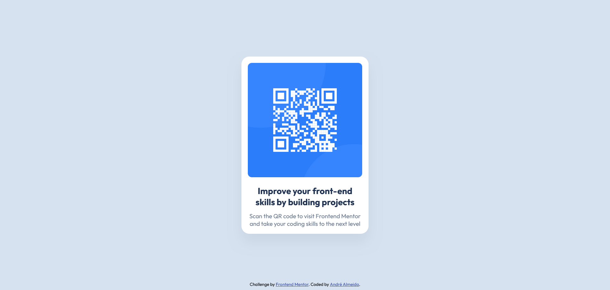

# Frontend Mentor - QR code component solution

This is a solution to the [QR code component challenge on Frontend Mentor](https://www.frontendmentor.io/challenges/qr-code-component-iux_sIO_H). Frontend Mentor challenges help you improve your coding skills by building realistic projects.

## Table of contents

- [Overview](#overview)
  - [Screenshot](#screenshot)
  - [Links](#links)
- [My process](#my-process)
  - [Built with](#built-with)
  - [What I learned](#what-i-learned)
  - [Continued development](#continued-development)
- [Author](#author)

## Overview

### Screenshot

### Links

- Solution URL: (https://qr-code-component-fgl4.vercel.app/)
- Live Site URL: (http://127.0.0.1:5500/qr-code-component-main/index.html)

## My process

### Built with

- Semantic HTML5 markup
- CSS custom properties
- Flexbox
- Mobile-first workflow
- Live Server
- Image preview
- Path Intellisense
- Prettier

### What I learned

I learned how to use and apply some basic fundamentals of HTML and CSS, as well as perform the deploy through Vercel. I hope to improve even more in the upcoming projects.

### Continued development

I hope to continue improving in the use of HTML and CSS, as well as continuing my studies with JavaScript, React, Node, etc.

## Author

- Linkedin - [André Almeida](https://www.linkedin.com/in/andr%C3%A9-almeida-0b6300324/)
- Portfolio - [André Almeida](https://ratiopitag.wixsite.com/meusite)
- Frontend Mentor - [@andre-almeida-2121](https://www.frontendmentor.io/profile/andre-almeida-2121)
